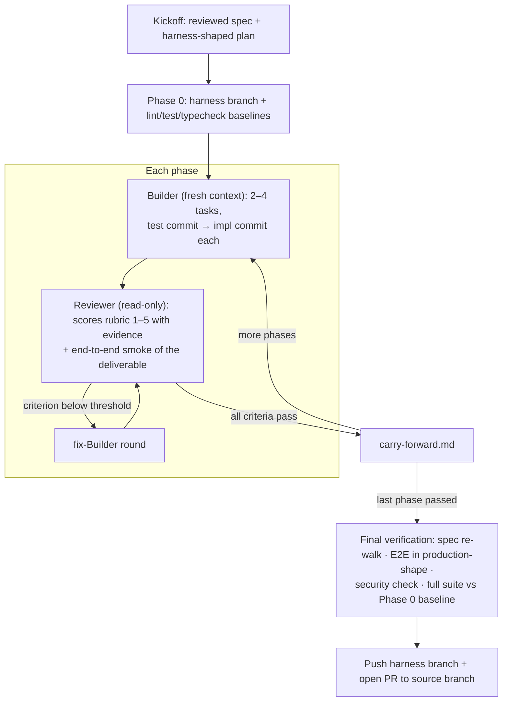

# fram-loop

A two-agent autonomous development pattern for shipping any long-running coding deliverable end-to-end without human intervention mid-run — features, refactors, migrations, library design, perf projects, large cleanups. A **Builder** agent implements each phase with a fresh context; a **Reviewer** agent scores against a rubric and exercises the deliverable end-to-end (browser for UI; HTTP / CLI / DB / library invocation for non-UI). Phase-based context resets prevent the model from trying to wrap up early as context fills.

**Output is a finished deliverable working in production-shape, on an isolated harness branch with a PR opened back to the source branch.**

## Install

```bash
# GitHub CLI (gh ≥ 2.90)
gh skill install TheRealClodius/fram-loop

# or via the skills.sh CLI
npx skills add TheRealClodius/fram-loop
```

The skill follows the [agentskills.io](https://agentskills.io) convention, so either installer can target any agent that supports it — Claude Code, Codex CLI, Copilot, Cursor, Gemini CLI, Antigravity, etc. (`gh skill install --agent claude-code` to pick the target). You can also browse it on [skills.sh](https://www.skills.sh/TheRealClodius/fram-loop/fram-loop).

## Use

The skill is **consent-gated, not magic-phrase-gated**: an agent that spots a fram-loop-shaped task (multi-phase deliverable, spec + plan present) may suggest the loop, but only you can start a run. Any clear request counts — "use the fram-loop", "fram-loop this", "kick off the loop on this spec" — exact phrasing doesn't matter. What never happens: a run starting without your yes; it commits hours of wall-clock and millions of tokens, autonomously, to an opened PR.

Prerequisites: a reviewed spec and a harness-shaped plan (2–4 tasks per phase, each phase independently testable end-to-end). The skill itself documents how to author both as preparation work if they don't exist. Run it in an autonomous environment: Claude Code with bypass/auto permissions, or Codex with full filesystem/network access and no approval interruptions for routine commands.

A kickoff looks like:

> I have a reviewed spec at `docs/checkout-redesign-spec.md` and a phased plan at `docs/checkout-redesign-plan.md`. Use the fram-loop.

Then step away. The loop comes back in one of three states: `complete` (PR opened back to your branch), `partial` (locally verified; exact push/PR retry commands surfaced), or `blocked` (with a specific diagnosis, not a shrug).

## Run safely

Autonomous mode + broad shell access is a real attack/blast surface. The skill self-enforces a runtime safety boundary (no global-config writes, no package publishes, no destructive `gh`, no secrets reads, network restraint — see [SKILL.md §Defaults #10–#12](skills/fram-loop/SKILL.md)) and ships a frozen-install default and prompt-injection awareness. Pair that with operator-side controls when you run it:

- **Isolate the runtime.** Dedicated VM / CI runner / fresh clone, or at least a `git worktree` (the skill's Prerequisites recommend this). Non-production network where possible.
- **Minimise secrets.** Dev/staging credentials only; short-lived tokens; no prod keys, no PII in the agent's environment. Optional: a secret-scanning hook that fails the run on a bad commit.
- **Limit Git/GitHub power.** Least-privilege tokens; branch protection on the source branch (the loop assumes you can't merge unsupervised). The skill checks PR `--base`/`--head` against the recorded Run Configuration before pushing.
- **Lock the verification surface.** Dedicated browser profile for the Reviewer's MCP — no SSO, no logged-in prod sessions. Smoke targets pinned to localhost; disposable / clearly-non-prod DBs with URLs supplied by the runner, not the repo.
- **Harden supply chain.** Lockfile + frozen installs (skill default — §Defaults #11). Pinned runtimes. Stricter install flags only if the project still works under them.

The skill internalises what it can; the rest is your environment.

## How it works (in 30 seconds)



1. The orchestrator creates `fram/<source-leaf>-<feature-slug>-<source-sha>` from the current branch tip and targets the final PR back to that source branch.
2. Per-feature directory `fram-loop/<feature>/` holds `spec.md`, `plan.md`, baseline outputs, a live `RUN.md` (state machine + Phase Status table), and `phases/phase-N/` files (every prompt sent + report received).
3. For each phase: orchestrator dispatches a fresh Builder, then a Reviewer. Reviewer scores 1–5 with file:line evidence on two universal criteria (Functionality, Code Quality) plus deliverable-shape criteria the run picks (e.g. Design Quality + Accessibility for UI; Contract Compliance + Observability for an HTTP API; Data Integrity + Performance for a migration).
4. Pass → next phase. Fail → fix-Builder + re-review until done. The loop never halts on transient friction; it adapts (re-interpret spec, narrow scope, insert recovery phase) and freight-trains to `complete`, `partial`, or `blocked`.
5. Final verification gate: spec re-walk + end-to-end exercise of the deliverable in production-shape + project-appropriate security check + full suite/lint/typecheck against the Phase 0 baseline + push/PR creation.

## Defaults baked in

- **Strict TDD** per task (test commit Red → impl commit; never bundled). RED-fix-forward refinement allowed with explicit proof — a separate refinement commit or a committed proof file.
- **Harness branch from the start** so Red commits and recovery work never land on the user's source branch.
- **Phase 0 lint/test/typecheck baseline** so reviewers fail only on new debt, not known repo debt.
- **Mandatory end-to-end smoke** in production-shape for any phase that affects observable behaviour — browser MCP for UI; HTTP / CLI / library-consumer / non-prod DB invocation for non-UI.
- **Call-site enumeration** when changing any interface boundary (HTTP shape, function signature, CLI flags, schema, library API).
- **Model routing** (provider-agnostic): best model for Reviewer always; cheap-out OK on mechanical Builder work; commit-agent for recovery.
- **PR handoff** when complete; if GitHub auth/network fails after local verification, the loop returns `partial` with exact retry commands and a PR body draft.
- **Resilience over rigidity** — adapt, don't halt.

Full skill spec: [skills/fram-loop/SKILL.md](skills/fram-loop/SKILL.md).

## Evidence so far

One full eval run is on the record — see [EVALS.md](EVALS.md). The fixture: *The Margin*, an Astro 6 + React 19 editorial magazine — 12 MDX articles, a paywall, a GSAP-driven physics interactive, Pagefind search, RSS/sitemap, Lighthouse-gated perf and a11y — shipped across 8 phases.

- 8/8 phases passed review on the first attempt; **0 fix rounds**
- 32 tasks, each with a separate Red test commit and impl commit; 4 RED-fix-forwards, all with proof artifacts
- 358 tests at run end; Lighthouse 0.99 performance / 0.96 accessibility
- Carry-forward chain closed at **zero open items**
- Cost: **~5h wall-clock, ~2.1M tokens** across all agents

That cost line is the honest trade: the loop buys autonomy and thoroughness with compute. It's the wrong tool for single-task work — see "When NOT to use" in the skill.

Also honest: that's one run, on one deliverable shape (UI). The rubric tails and smoke drivers for APIs, CLIs, libraries, migrations, refactors, and perf work are designed in but not yet eval'd. [EVALS.md §6](EVALS.md) lists the planned follow-ups (pass^k reliability, non-UI deliverables, adversarial specs, prompt-injection resilience).

## Lineage and what fram-loop adds

fram-loop builds on two prior efforts:

- Geoffrey Huntley's [Ralph Loop](https://ghuntley.com/loop/) — stateless iteration with a fresh agent per task; state lives in git history and a progress file. Establishes "context resets > context compaction" as the discipline that prevents the model trying to wrap up early as context fills.
- Anthropic's [effective harness for long-running agents](https://www.anthropic.com/engineering/effective-harnesses-for-long-running-agents) — file-based state continuity (`claude-progress.txt`, `feature_list.json`, git), end-to-end verification via browser automation, one feature per session as the unit of work, and the central failure-mode insight that *"Claude tended to make code changes…but would fail to recognize that the feature didn't work end-to-end."* That insight drives fram-loop's mandatory end-to-end smoke.

What fram-loop adds on top:

1. **Two distinct agent roles, not two sessions of the same coder.** Builder has full edit access; Reviewer is read-only with verification tools and never implements. Different prompts, different tools, different responsibilities — no self-evaluation.
2. **Numeric multi-criterion rubric.** 1–5 scoring with explicit thresholds and file:line evidence requirements, instead of pass/fail self-test. Universal criteria (Functionality, Code Quality) plus deliverable-shape criteria for UI / API / library / CLI / migration / refactor / perf work.
3. **Phases as the orchestration unit.** 2–4 related tasks share a Builder context; the Reviewer evaluates the coherent unit. Amortizes agent bootstrap and produces a meaningful review surface.
4. **TDD as a per-task structural rule.** Separate Red and Green commits per task; Reviewer checks out the test commit and confirms it fails. Never `--no-verify`; hook-blocked Red gets a `red-proof-task-X.md` artifact.
5. **Phase 0 lint/test/typecheck baseline.** Reviewers fail on new debt only, not pre-existing repo debt — real codebases have known failures and we refuse to confuse them with regressions.
6. **Carry-forward chain.** Non-blocking warnings flow phase→phase verbatim in the next Builder's prompt, without bloating each Builder's context with full prior reports.
7. **Harness branch + PR handoff as the completion artifact.** Red commits never pollute the source branch; `complete` requires the harness branch pushed and PR opened; push failure → `partial` with retry commands and a draft PR body.
8. **Provider-agnostic routing with a strict "never cheap-out on Reviewer" rule.** A bad review costs a wasted fix round; the Reviewer always gets the best available model.
9. **Deliverable-agnostic by design.** Smoke driver, rubric, and verification tooling adapt to UI, HTTP API, CLI, library/SDK, DB migration, refactor, or perf work — same loop, different tail.

## Why "did I complete the goal?" instead of a fix-round cap

Most multi-agent harnesses (Ralph forks, the Composio orchestrator, htdocs.dev's reference architecture) cap iterations at 3–5 stuck rounds and halt. That cap comes from a safety/compute lineage: bound how long the loop can burn money, fail gracefully, return control. Sensible default when you don't know whether the agent is making progress.

fram-loop deliberately rejects it. Most "stuck" rounds are not stuck — they're misframed. The plan's task split is wrong, the spec section is ambiguous, the rubric threshold doesn't fit this surface, a dependency conflict surfaced mid-run. All of these are cheap to fix once recognized; a fixed cap halts the loop before recognition happens. The right primitive is "did I complete the goal?" with explicit `blocked` criteria for genuine impossibility (spec contradicts itself, environment broken, external dependency missing after workarounds attempted). The trade-off is real — fram-loop can spend more compute than a capped loop on a hard run — but for a high-autonomy skill the user has explicitly opted into, "ship the deliverable" is the right objective.

## About

fram-loop is designed and maintained by [Andrei Clodius](https://www.linkedin.com/in/andrei-clodius-41568654/) of [fram.design](https://fram.design) ([@TheRealClodius](https://github.com/TheRealClodius) on GitHub). Issues and PRs welcome.

## License

MIT — see [LICENSE](LICENSE).
